# Architecture Documentation

This document provides a comprehensive overview of the Django Ninja Boilerplate architecture, including system design, component relationships, and deployment strategies.

## Table of Contents

- [System Overview](#system-overview)
- [Application Architecture](#application-architecture)
- [Progressive Controller Patterns](#progressive-controller-patterns)
- [Docker Architecture](#docker-architecture)
- [Database Schema](#database-schema)
- [API Design](#api-design)
- [Authentication Flow](#authentication-flow)
- [Background Tasks](#background-tasks)
- [Real-Time Messaging](./REALTIME.md) (Centrifugo)
- [Deployment Options](#deployment-options)

---

## System Overview

### High-Level Architecture

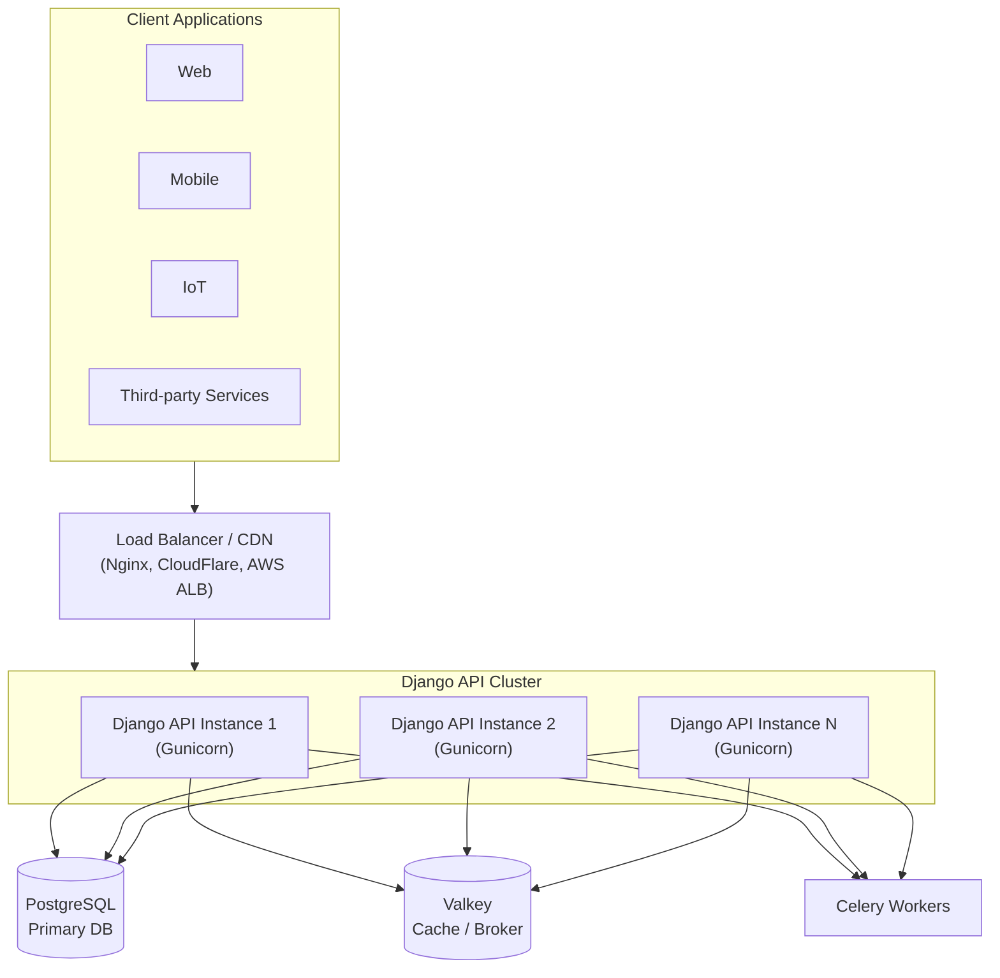

### Component Summary

| Component | Purpose | Technology |
|-----------|---------|------------|
| **API Server** | REST API endpoints | Django Ninja + Gunicorn |
| **Database** | Persistent data storage | PostgreSQL 17 |
| **Cache/Broker** | Caching & message queue | Valkey 8 (Redis-compatible) |
| **Task Queue** | Background job processing | Celery |
| **Scheduler** | Periodic task scheduling | Celery Beat |
| **Monitoring** | Task monitoring UI | Flower |
| **Tracing** | Distributed tracing | OpenTelemetry + Jaeger |
| **Metrics** | Application metrics | Prometheus |
| **Real-Time** | WebSocket messaging | Centrifugo v5 |
| **Audit Log** | Compliance tracking | Django signals + middleware |
| **Feature Flags** | Gradual rollouts & A/B testing | Custom service |

---

## Application Architecture

### Django App Structure

```
django-ninja-boilerplate/
│
├── api/                          # API Configuration & Utilities
│   ├── settings/                 # Environment-specific settings
│   │   ├── common.py            # Shared settings
│   │   ├── dev.py               # Development overrides
│   │   ├── prod.py              # Production overrides
│   │   └── test.py              # Test settings (SQLite locally, PostgreSQL in CI)
│   ├── pagination/              # Pagination utilities
│   │   ├── schemas.py           # Pydantic schemas
│   │   ├── offset.py            # Offset-based pagination
│   │   ├── cursor.py            # Cursor-based pagination
│   │   └── decorators.py        # View decorators
│   ├── throttling/              # Rate limiting
│   │   ├── limiter.py           # Rate limiter classes
│   │   └── decorators.py        # Throttle decorators
│   ├── utils/                   # HTTP utilities, HTTP client
│   ├── centrifugo.py            # Centrifugo JWT tokens + HTTP client
│   ├── decorators.py            # API decorators
│   ├── exceptions.py            # Custom exceptions
│   ├── middleware.py            # Request/Response middleware
│   └── urls.py                  # URL routing
│
├── core/                         # Core Application (Users/Auth)
│   ├── controllers/             # API Controllers
│   │   ├── auth_controller.py   # JWT authentication
│   │   ├── centrifugo_controller.py # Real-time token endpoints
│   │   ├── users_controller.py  # User management
│   │   └── otp_controller.py    # OTP/Magic link auth
│   ├── audit/                   # Audit logging system
│   │   ├── models.py            # AuditLog model
│   │   ├── middleware.py        # Request logging
│   │   ├── signals.py           # Model change tracking
│   │   └── decorators.py        # @audit_action
│   ├── features/                # Feature flags
│   │   ├── models.py            # FeatureFlag model
│   │   ├── service.py           # Flag evaluation
│   │   └── middleware.py        # Request flag attachment
│   ├── observability/           # Monitoring & tracing
│   │   ├── tracing.py           # OpenTelemetry setup
│   │   ├── metrics.py           # Prometheus metrics
│   │   ├── logging.py           # Structured logging
│   │   └── health.py            # Health checks
│   ├── tasks/                   # Task management
│   │   ├── base.py              # ProgressTask, CriticalTask
│   │   ├── progress.py          # Progress tracking
│   │   ├── dlq.py               # Dead Letter Queue
│   │   └── scheduler.py         # Periodic tasks
│   ├── models/                  # Django models
│   ├── schemas/                 # Request/Response schemas
│   ├── services/                # Business logic
│   └── tests/                   # Unit tests
│
├── todos/                        # Example Feature App
│   ├── controllers/             # Todo API controllers
│   ├── models/                  # Todo model
│   ├── schemas/                 # Todo schemas
│   └── tests/                   # Todo tests
│
└── cli/                          # CLI Tool (separate package)
    └── src/django_ninja_matt/
        ├── commands/            # CLI commands
        └── generators/          # Project generators
```

### Request Flow

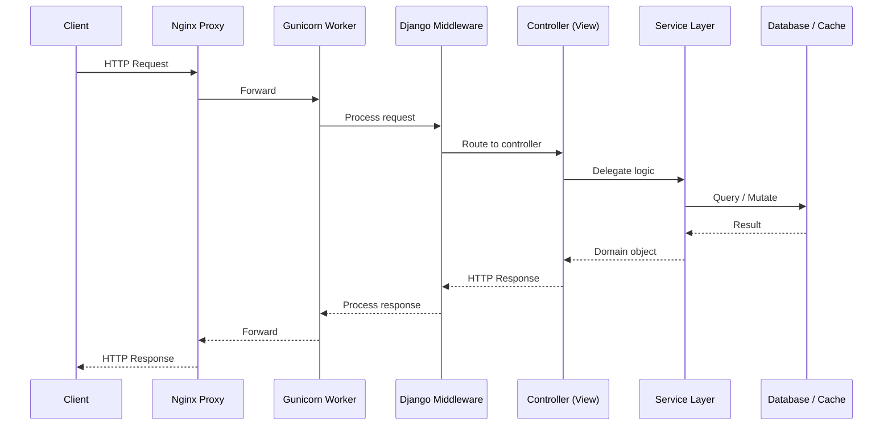

### Layer Responsibilities

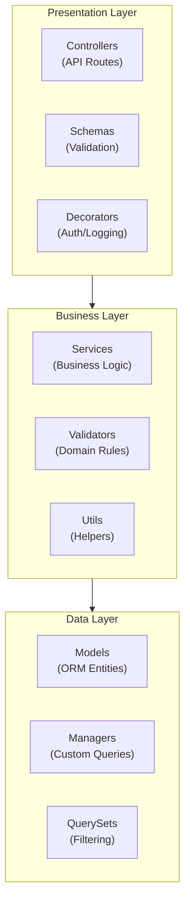

---

## Progressive Controller Patterns

The `todos` app ships four controller variants that demonstrate a progression from maximum verbosity to full service-layer abstraction. All four expose the same CRUD surface — only the implementation style differs.

### Pattern Summary

| Pattern | File | Route Prefix | When to Use |
|---------|------|-------------|-------------|
| **1 — Declarative** | `todo_controller_declarative.py` | `/api/todos-declarative/` | Learning the framework; teams that want full visibility into every error path |
| **2 — Basic** | `todo_controller_basic.py` | `/api/todos-basic/` | Small projects; developers who prefer minimal abstraction |
| **3 — Partial** | `todo_controller_partial.py` | `/api/todos-partial/` | When reads are simple but writes need structured error handling and logging |
| **4 — Full (service layer)** | `todo_controller.py` | `/api/todos/` | Production code; teams with multiple controllers sharing business logic |

### Controller to Service Layer Relationship

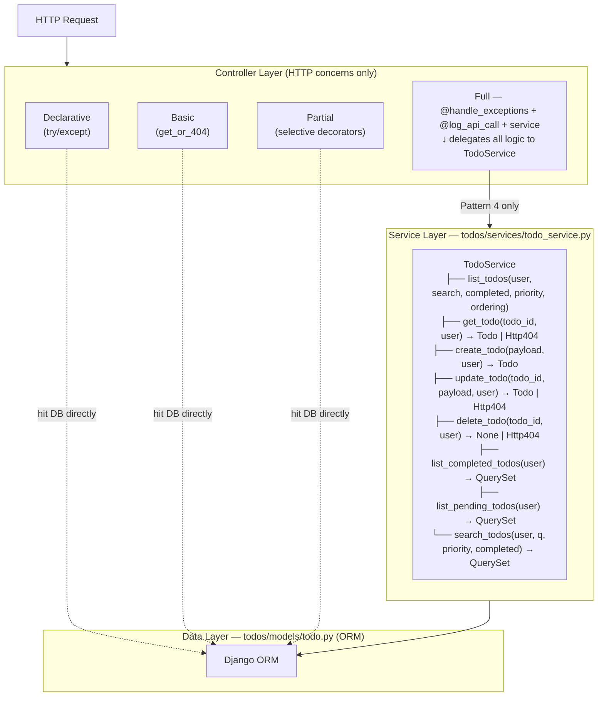

### Pattern Comparison

**Pattern 1 — Declarative** (`todo_controller_declarative.py`)

Every method wraps its body in `try/except`. No decorator magic. Best for teams that want every error path explicit in the code rather than handled by a shared decorator.

```python
@http_post("/", response={201: TodoSchema, 400: dict, 500: dict})
def create_todo(self, request, payload: CreateTodoSchema):
    try:
        todo_data = payload.model_dump()
        todo_data["user"] = request.user
        todo = Todo.objects.create(**todo_data)
        return 201, todo
    except Exception as exc:
        logger.exception("Failed to create todo")
        return 500, {"error": "Internal server error", "detail": str(exc)}
```

**Pattern 2 — Basic** (`todo_controller_basic.py`)

Uses `get_object_or_404` for lookup safety. No custom decorators. Errors that aren't 404s propagate to Django Ninja's default exception handler. Best as a clean starting point.

```python
@http_post("/", response={201: TodoSchema})
def create_todo(self, request, payload: CreateTodoSchema):
    todo_data = payload.model_dump()
    todo_data["user"] = request.user
    todo = Todo.objects.create(**todo_data)
    return 201, todo
```

**Pattern 3 — Partial** (`todo_controller_partial.py`)

Reads are undecorated. Writes use `@handle_exceptions` and `@log_api_call`. Shows that you can mix and match rather than applying decorators uniformly.

```python
# Read — no decorators needed
@http_get("/{todo_id}", response={200: TodoSchema, 404: dict})
def get_todo(self, request, todo_id: str):
    return get_object_or_404(Todo, id=todo_id, user=request.user)

# Write — decorated for observability and error handling
@http_post("/", response={201: TodoSchema, 400: dict, 500: dict})
@log_api_call(include_payload=True, include_response=False)
@handle_exceptions(return_500_on_error=True, log_errors=True)
def create_todo(self, request, payload: CreateTodoSchema):
    todo_data = payload.model_dump()
    todo_data["user"] = request.user
    return 201, Todo.objects.create(**todo_data)
```

**Pattern 4 — Full service layer** (`todo_controller.py`) — recommended for production

Controller is a thin HTTP adapter. All business logic lives in `TodoService`, injected via `__init__`. Methods are one-liners. The service is trivially swappable in tests.

```python
class TodoController:
    def __init__(self):
        self.service = TodoService()

    @http_post("/", response={201: TodoSchema, 400: dict, 500: dict})
    @log_api_call(include_payload=True, include_response=False)
    @handle_exceptions(return_500_on_error=True, log_errors=True)
    @validate_request()
    def create_todo(self, request, payload: CreateTodoSchema):
        return 201, self.service.create_todo(payload, request.user)
```

### Decorator Stack (Patterns 3 and 4)

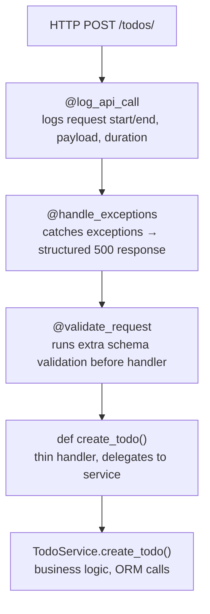

---

## Docker Architecture

### Multi-Stage Build Process

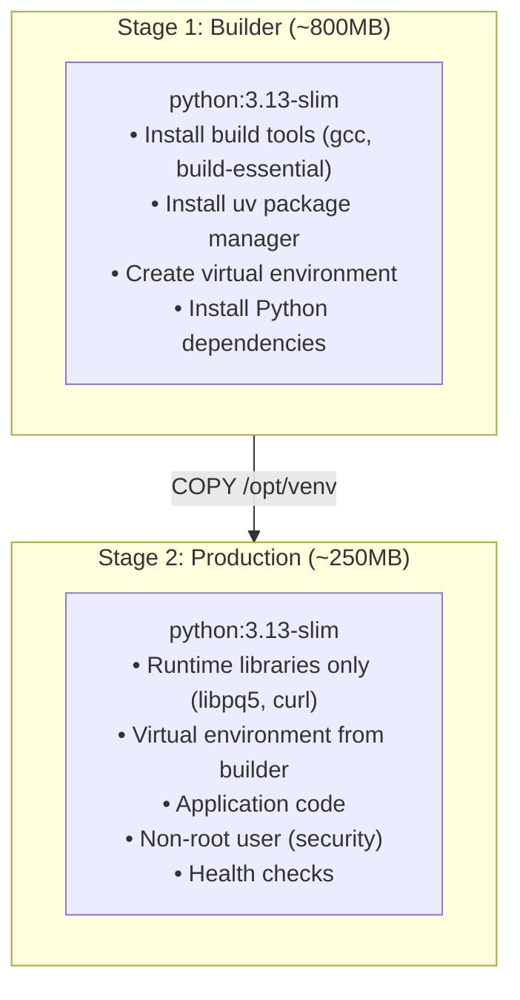

### Docker Compose Services

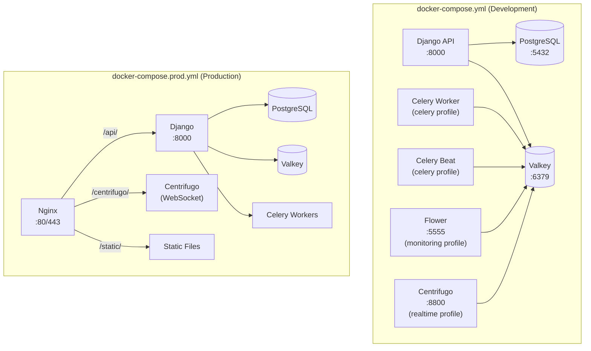

### Dockerfile Variants

| Dockerfile | Use Case | Base Image | Size | Features |
|------------|----------|------------|------|----------|
| `Dockerfile` | Production | python:3.13-slim | ~250MB | Multi-stage, health checks, security |
| `Dockerfile.uv` | CI/CD | uv:python3.13 | ~200MB | Fast builds, UV native |
| `deploy/docker/Dockerfile.single` | PaaS | python:3.13-slim | ~250MB | Single container, health checks |

---

## Database Schema

### Entity Relationship Diagram

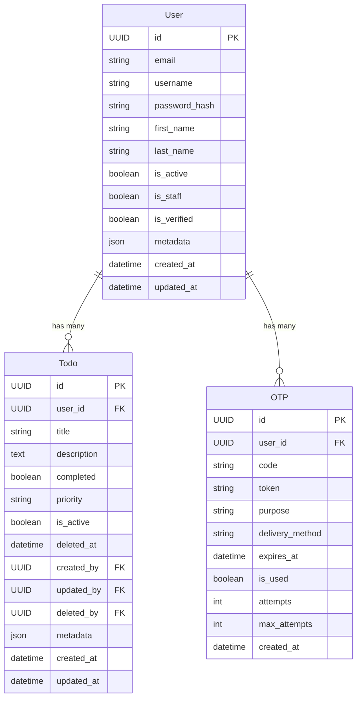

---

## API Design

### Endpoint Structure

```
/api/
├── /health/                    # Health check
│   └── GET                     # → HealthResponse
│
├── /auth/                      # Authentication
│   ├── /login/                 # POST → TokenResponse
│   ├── /logout/                # POST → MessageResponse
│   ├── /register/              # POST → UserResponse
│   ├── /refresh/               # POST → TokenResponse
│   └── /otp/                   # OTP Authentication
│       ├── /request/           # POST → OTPResponse
│       └── /verify/            # POST → TokenResponse
│
├── /users/                     # User Management
│   ├── GET                     # List users (admin)
│   ├── /me/                    # GET → Current user
│   └── /{id}/                  # GET/PUT/DELETE
│
├── /realtime/                  # Centrifugo Real-Time
│   ├── /connection-token/      # POST → ConnectionTokenResponse
│   └── /subscription-token/    # POST → SubscriptionTokenResponse
│
└── /todos/                     # Example Resource
    ├── GET                     # List (paginated)
    ├── POST                    # Create
    └── /{id}/
        ├── GET                 # Retrieve
        ├── PUT                 # Update
        └── DELETE              # Delete
```

### Response Patterns

```python
# Success Response
{
    "items": [...],           # For lists
    "meta": {                 # Pagination metadata
        "current_page": 1,
        "per_page": 20,
        "total_items": 100,
        "total_pages": 5
    }
}

# Error Response
{
    "error": "Error message",
    "code": "ERROR_CODE",
    "details": {...}          # Optional
}
```

---

## Authentication Flow

### JWT Authentication

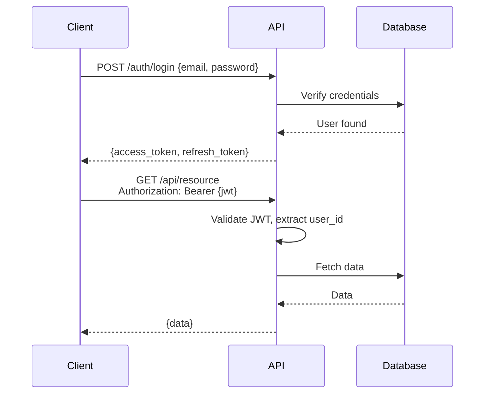

### OTP / Magic Link Flow

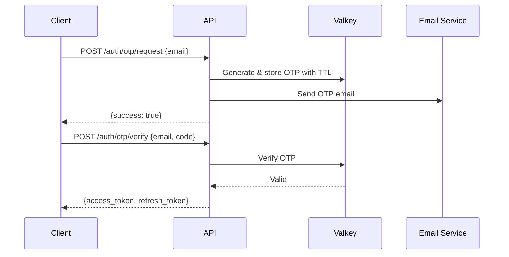

---

## Background Tasks

### Celery Architecture

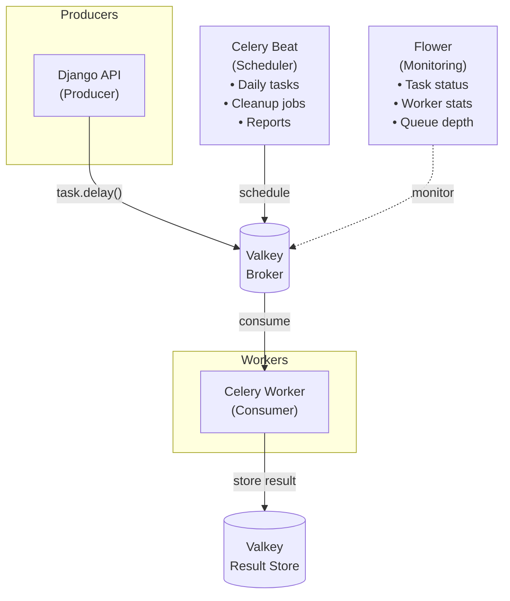

---

## Deployment Options

### Decision Tree

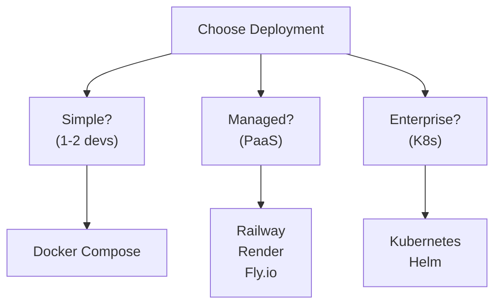

### Deployment Comparison

| Feature | Docker Compose | PaaS | Kubernetes |
|---------|---------------|------|------------|
| **Complexity** | Low | Low | High |
| **Scaling** | Manual | Auto | Auto |
| **Cost** | Fixed server | Pay-per-use | Variable |
| **Control** | Full | Limited | Full |
| **Setup Time** | Minutes | Minutes | Hours |
| **Best For** | Dev/Small prod | Startups | Enterprise |

### Kubernetes Architecture

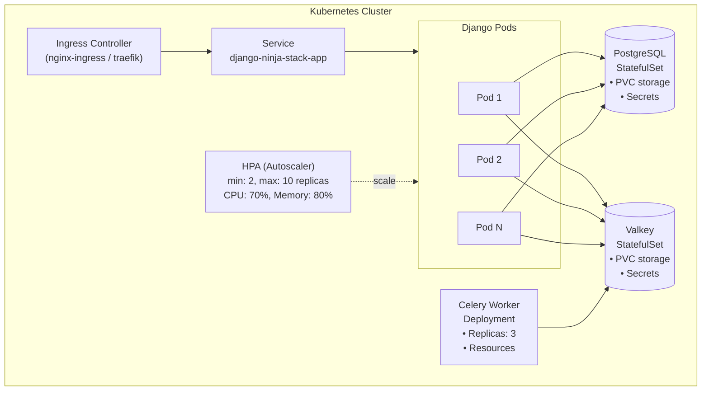

---

## Performance Considerations

### Gunicorn Worker Configuration

```
Workers = (2 × CPU cores) + 1

Example for 4-core server:
  Workers = (2 × 4) + 1 = 9

With threads (gthread worker class):
  Workers = CPU cores
  Threads per worker = 2-4

Memory per worker: ~50-100MB
Total memory = Workers × Memory per worker
```
