# Architecture Documentation

This document provides a comprehensive overview of the Django Ninja Boilerplate architecture, including system design, component relationships, and deployment strategies.

## Table of Contents

- [System Overview](#system-overview)
- [Application Architecture](#application-architecture)
- [Progressive Controller Patterns](#progressive-controller-patterns)
- [Docker Architecture](#docker-architecture)
- [Database Schema](#database-schema)
- [API Design](#api-design)
- [Authentication Flow](#authentication-flow)
- [Background Tasks](#background-tasks)
- [Real-Time Messaging](./REALTIME.md) (Centrifugo)
- [Deployment Options](#deployment-options)

---

## System Overview

### High-Level Architecture

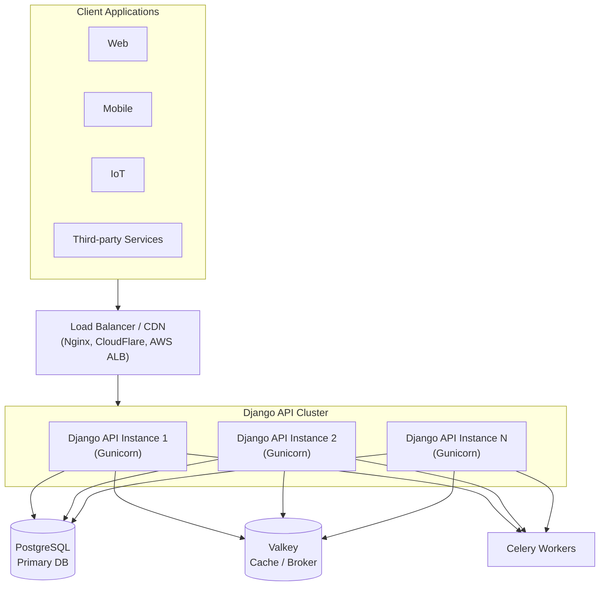
```mermaid
graph TB
    subgraph Clients["Client Applications"]
        Web["Web"]
        Mobile["Mobile"]
        IoT["IoT"]
        ThirdParty["Third-party Services"]
    end

    LB["Load Balancer / CDN<br/>(Nginx, CloudFlare, AWS ALB)"]

    subgraph API["Django API Cluster"]
        API1["Django API Instance 1<br/>(Gunicorn)"]
        API2["Django API Instance 2<br/>(Gunicorn)"]
        APIN["Django API Instance N<br/>(Gunicorn)"]
    end

    PG[("PostgreSQL<br/>Primary DB")]
    Redis[("Valkey<br/>Cache / Broker")]
    Celery["Celery Workers"]

    Clients --> LB --> API
    API1 & API2 & APIN --> PG
    API1 & API2 & APIN --> Redis
    API1 & API2 & APIN --> Celery
```

### Component Summary

| Component | Purpose | Technology |
|-----------|---------|------------|
| **API Server** | REST API endpoints | Django Ninja + Gunicorn |
| **Database** | Persistent data storage | PostgreSQL 17 |
| **Cache/Broker** | Caching & message queue | Valkey 8 (Redis-compatible) |
| **Task Queue** | Background job processing | Celery |
| **Scheduler** | Periodic task scheduling | Celery Beat |
| **Monitoring** | Task monitoring UI | Flower |
| **Tracing** | Distributed tracing | OpenTelemetry + Jaeger |
| **Metrics** | Application metrics | Prometheus |
| **Real-Time** | WebSocket messaging | Centrifugo v5 |
| **Audit Log** | Compliance tracking | Django signals + middleware |
| **Feature Flags** | Gradual rollouts & A/B testing | Custom service |

---

## Application Architecture

### Django App Structure

```
django-ninja-boilerplate/
│
├── api/                          # API Configuration & Utilities
│   ├── settings/                 # Environment-specific settings
│   │   ├── common.py            # Shared settings
│   │   ├── dev.py               # Development overrides
│   │   ├── prod.py              # Production overrides
│   │   └── test.py              # Test settings (SQLite locally, PostgreSQL in CI)
│   ├── throttling/              # Rate limiting
│   │   ├── limiter.py           # Rate limiter classes
│   │   └── decorators.py        # Throttle decorators
│   ├── utils/                   # HTTP utilities, HTTP client
│   ├── centrifugo.py            # Centrifugo JWT tokens + HTTP client
│   ├── decorators.py            # API decorators
│   ├── exceptions.py            # Custom exceptions
│   ├── middleware.py            # Request/Response middleware
│   └── urls.py                  # URL routing
│
├── core/                         # Core Application (Users/Auth)
│   ├── controllers/             # API Controllers
│   │   ├── auth_controller.py   # JWT authentication
│   │   ├── centrifugo_controller.py # Real-time token endpoints
│   │   ├── users_controller.py  # User management
│   │   └── otp_controller.py    # OTP/Magic link auth
│   ├── audit/                   # Audit logging system
│   │   ├── models.py            # AuditLog model
│   │   ├── middleware.py        # Request logging
│   │   ├── signals.py           # Model change tracking
│   │   └── decorators.py        # @audit_action
│   ├── features/                # Feature flags
│   │   ├── models.py            # FeatureFlag model
│   │   ├── service.py           # Flag evaluation
│   │   └── middleware.py        # Request flag attachment
│   ├── observability/           # Monitoring & tracing
│   │   ├── tracing.py           # OpenTelemetry setup
│   │   ├── metrics.py           # Prometheus metrics
│   │   ├── logging.py           # Structured logging
│   │   └── health.py            # Health checks
│   ├── tasks/                   # Task management
│   │   ├── base.py              # ProgressTask, CriticalTask
│   │   ├── progress.py          # Progress tracking
│   │   ├── dlq.py               # Dead Letter Queue
│   │   └── scheduler.py         # Periodic tasks
│   ├── models/                  # Django models
│   ├── schemas/                 # Request/Response schemas
│   ├── services/                # Business logic
│   └── tests/                   # Unit tests
│
├── todos/                        # Example Feature App
│   ├── controllers/             # Todo API controllers
│   ├── models/                  # Todo model
│   ├── schemas/                 # Todo schemas
│   └── tests/                   # Todo tests
│
└── cli/                          # CLI Tool (separate package)
    └── src/django_ninja_matt/
        ├── commands/            # CLI commands
        └── generators/          # Project generators
```

### Optional apps: files and webhooks

The `files` and `webhooks` apps are off by default. Each app has a flag in
`api/settings/common.py`. The flag adds the app to `INSTALLED_APPS`, and
`api/urls.py` registers the controller only when the flag is on.

| Setting | Default | Purpose |
|---|---|---|
| `FILES_ENABLED` | `false` | Installs `files` and registers `/api/files/`. |
| `FILES_MAX_UPLOAD_BYTES` | `10485760` | Largest accepted upload, in bytes. |
| `FILES_ALLOWED_CONTENT_TYPES` | JPEG, PNG, GIF, WebP, PDF | Accepted content types. |
| `WEBHOOKS_ENABLED` | `false` | Installs `webhooks` and registers `/api/webhooks/`. |
| `WEBHOOKS_ALLOW_HTTP` | `false` | Accepts `http://` webhook URLs outside `DEBUG`. |

To turn on an app:

1. Set the flag to `true` in `.env`.
2. Run `uv run python manage.py migrate`.
3. Run the app tests with the flag on, for example
   `FILES_ENABLED=true WEBHOOKS_ENABLED=true uv run pytest files webhooks`.
   The default `testpaths` do not include these apps.

#### Webhook SSRF protection

Webhook URLs are user input, and the server sends requests to them.
`webhooks/ssrf.py` checks each URL when a user creates or updates a webhook,
and again before each delivery:

- Only `https` is accepted. `http` is accepted only when `DEBUG` or
  `WEBHOOKS_ALLOW_HTTP` is on. URLs with credentials are rejected.
- The host is resolved one time. The URL is rejected if any resolved address
  is private, loopback, link-local (including `169.254.169.254`), multicast,
  reserved, unspecified, or not globally routable. IPv4 addresses inside
  IPv4-mapped, 6to4, Teredo, and NAT64 IPv6 addresses are checked too.
- The request connects to the checked address. The `Host` header and TLS SNI
  keep the original hostname, so certificate checks still use the hostname
  and a DNS rebind cannot change the target.
- Redirects are not followed. Proxy environment variables are ignored. The
  connect timeout is 5 seconds and the request timeout is 10 seconds. Delivery
  stores at most 64 KiB of the response body.
- A blocked delivery records the error and does not retry. A DNS failure
  retries with backoff.

Residual risks:

- A public address that forwards traffic to your internal network is not
  detected. Add an egress firewall or an egress proxy for defense in depth.
- The receiver sees your server's public IP address.
- Stored webhook headers are sent as-is, except `Host`.

#### File upload validation

- The content type must be in `FILES_ALLOWED_CONTENT_TYPES` and must have a
  known magic-byte signature. SVG, HTML, and other active content are never
  accepted.
- The server generates the storage key:
  `users/<owner id>/<folder>/<random hex><extension>`. The client filename is
  never part of the key. The model keeps a sanitized display name in
  `filename` and the raw name in `metadata["original_filename"]`.
- With S3, the presigned POST enforces `content-length-range` (1 byte to
  `FILES_MAX_UPLOAD_BYTES`) and the exact `Content-Type`. The confirm step
  reads the object metadata and the first bytes. It rejects and deletes an
  object with a wrong size, type, or signature. The stored size replaces the
  size that the client reports.
- Without S3 (local development), the local-upload endpoint reads at most
  `FILES_MAX_UPLOAD_BYTES + 1` bytes, checks the magic bytes against the
  declared type, and writes only inside `MEDIA_ROOT`. `MEDIA_ROOT` is
  separate from `STATIC_ROOT`.

Residual risks:

- A magic-byte check does not prove that a file is safe. A polyglot file can
  pass. Scan uploads for malware if users share files.
- `is_public=true` uploads use the `public-read` ACL. Turn this off if your
  bucket must stay private.
- Serve user files from a separate domain (the S3 bucket or a CDN), not from
  the API origin.

### Request Flow

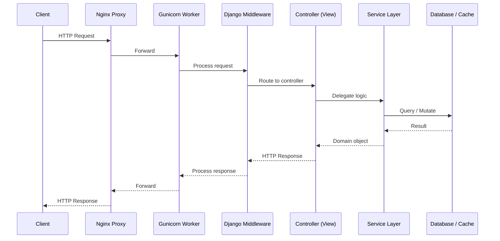
```mermaid
sequenceDiagram
    participant C as Client
    participant N as Nginx Proxy
    participant G as Gunicorn Worker
    participant M as Django Middleware
    participant V as Controller (View)
    participant S as Service Layer
    participant DB as Database / Cache

    C->>N: HTTP Request
    N->>G: Forward
    G->>M: Process request
    M->>V: Route to controller
    V->>S: Delegate logic
    S->>DB: Query / Mutate
    DB-->>S: Result
    S-->>V: Domain object
    V-->>M: HTTP Response
    M-->>G: Process response
    G-->>N: Forward
    N-->>C: HTTP Response
```

### Layer Responsibilities

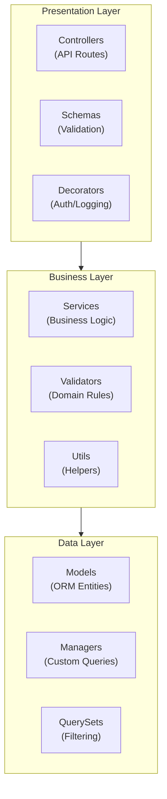
```mermaid
graph TB
    subgraph Presentation["Presentation Layer"]
        Controllers["Controllers<br/>(API Routes)"]
        Schemas["Schemas<br/>(Validation)"]
        Decorators["Decorators<br/>(Auth/Logging)"]
    end

    subgraph Business["Business Layer"]
        Services["Services<br/>(Business Logic)"]
        Validators["Validators<br/>(Domain Rules)"]
        Utils["Utils<br/>(Helpers)"]
    end

    subgraph Data["Data Layer"]
        Models["Models<br/>(ORM Entities)"]
        Managers["Managers<br/>(Custom Queries)"]
        QuerySets["QuerySets<br/>(Filtering)"]
    end

    Presentation --> Business --> Data
```

---

## Controller and service flow

The registered todo controller uses a service for data access. Other todo
controllers under `todos/controllers/` illustrate alternate patterns, but the
registered controller is the production example.

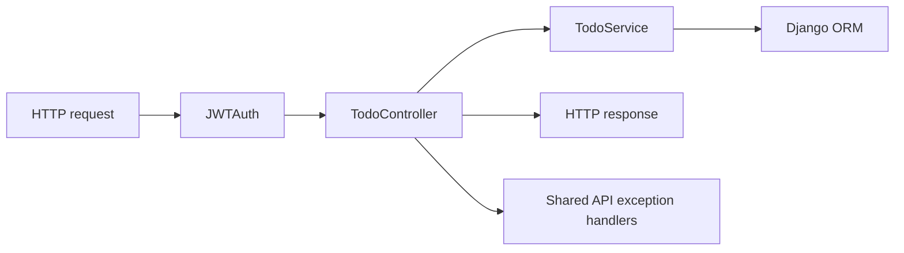
```mermaid
graph LR
    REQ["HTTP request"] --> AUTH["JWTAuth"]
    AUTH --> CTRL["TodoController"]
    CTRL --> SERVICE["TodoService"]
    SERVICE --> ORM["Django ORM"]
    CTRL --> RESP["HTTP response"]
    CTRL --> ERR["Shared API exception handlers"]
```

Declare protected controllers with `auth=JWTAuth()`. Declare public operations
with `auth=None`. Put `@http_*` first, followed by `@log_api_call()` when you
need request logging. Use `@paginate(PageNumberPaginationExtra)` for a paged
list and declare `PaginatedResponseSchema[ItemSchema]` as its response.
Register exception handlers once in `api/urls.py`; do not import a
per-operation exception decorator.

---

## Docker Architecture

### Multi-Stage Build Process

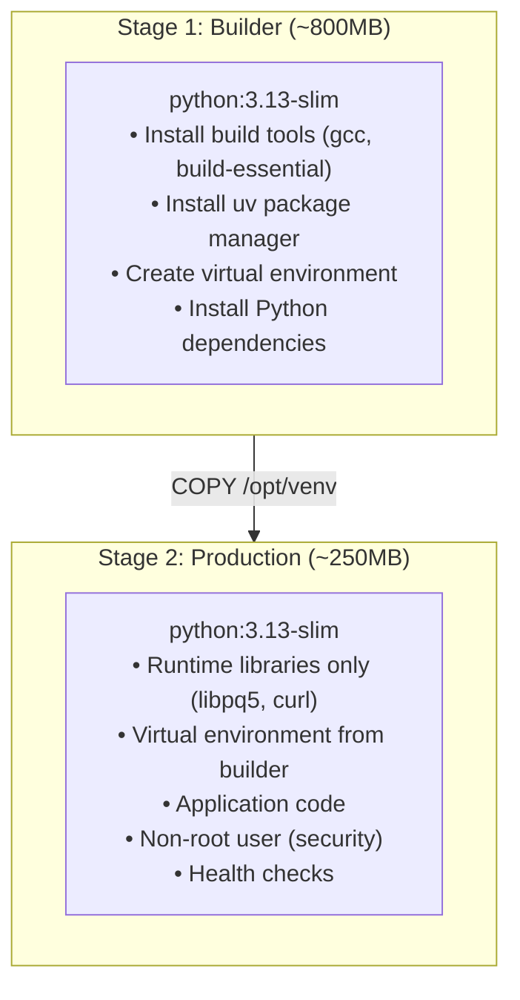
```mermaid
graph TB
    subgraph Stage1["Stage 1: Builder (~800MB)"]
        S1["python:3.13-slim<br/>• Install build tools (gcc, build-essential)<br/>• Install uv package manager<br/>• Create virtual environment<br/>• Install Python dependencies"]
    end

    subgraph Stage2["Stage 2: Production (~250MB)"]
        S2["python:3.13-slim<br/>• Runtime libraries only (libpq5, curl)<br/>• Virtual environment from builder<br/>• Application code<br/>• Non-root user (security)<br/>• Health checks"]
    end

    Stage1 -->|"COPY /opt/venv"| Stage2
```

### Docker Compose Services

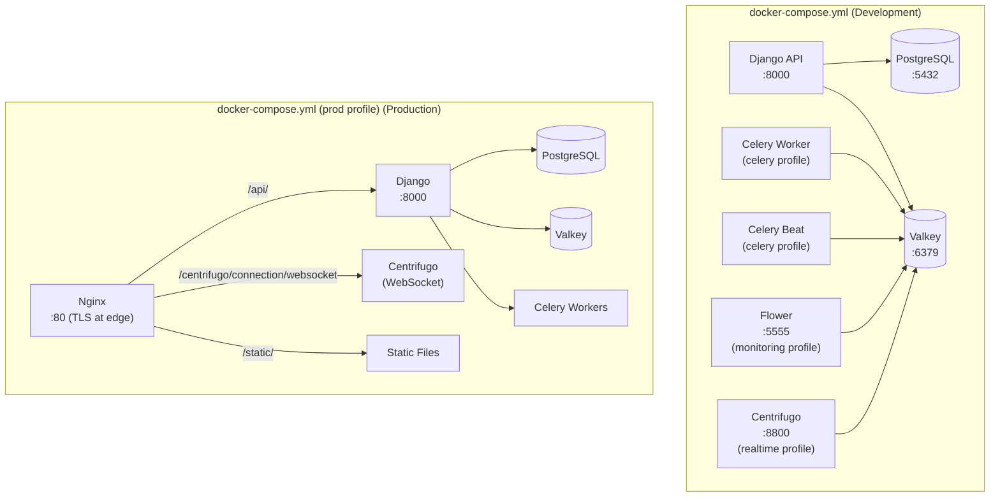
```mermaid
graph TB
    subgraph Dev["docker-compose.yml (Development)"]
        DB[("PostgreSQL<br/>:5432")]
        REDIS[("Valkey<br/>:6379")]
        DJANGO["Django API<br/>:8000"]
        CENT["Centrifugo<br/>:8800<br/>(realtime profile)"]
        WORKER["Celery Worker<br/>(celery profile)"]
        BEAT["Celery Beat<br/>(celery profile)"]
        FLOWER["Flower<br/>:5555<br/>(monitoring profile)"]

        DJANGO --> DB
        DJANGO --> REDIS
        WORKER --> REDIS
        BEAT --> REDIS
        FLOWER --> REDIS
        CENT --> REDIS
    end

    subgraph Prod["docker-compose.yml (prod profile) (Production)"]
        NGINX["Nginx<br/>:80 (TLS at edge)"]
        DJPROD["Django<br/>:8000"]
        CENTPROD["Centrifugo<br/>(WebSocket)"]
        STATIC["Static Files"]
        DBPROD[("PostgreSQL")]
        REDPROD[("Valkey")]
        CELPROD["Celery Workers"]

        NGINX -->|"/api/"| DJPROD
        NGINX -->|"/centrifugo/connection/websocket"| CENTPROD
        NGINX -->|"/static/"| STATIC
        DJPROD --> DBPROD & REDPROD & CELPROD
    end
```

### Dockerfile Variants

| Dockerfile | Use Case | Base Image | Size | Features |
|------------|----------|------------|------|----------|
| `Dockerfile` | Production | python:3.13-slim | ~250MB | Multi-stage, health checks, security |
| `deploy/docker/Dockerfile.single` | PaaS | python:3.13-slim | ~250MB | Single container, health checks |

---

## Database Schema

### Entity Relationship Diagram

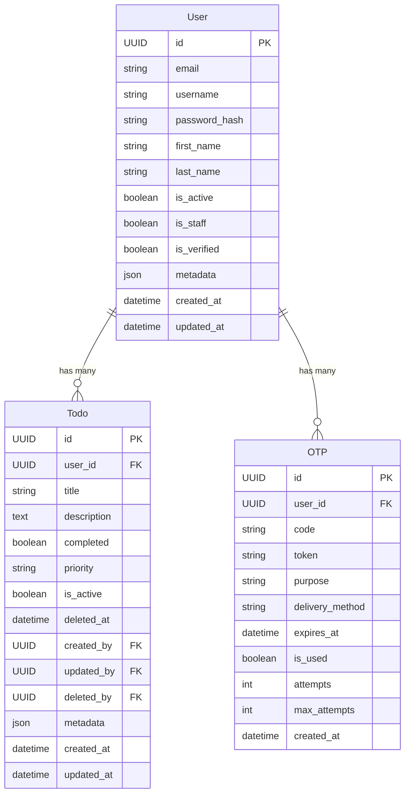
```mermaid
erDiagram
    User {
        UUID id PK
        string email
        string username
        string password_hash
        string first_name
        string last_name
        boolean is_active
        boolean is_staff
        boolean is_verified
        json metadata
        datetime created_at
        datetime updated_at
    }

    Todo {
        UUID id PK
        UUID user_id FK
        string title
        text description
        boolean completed
        string priority
        boolean is_active
        datetime deleted_at
        UUID created_by FK
        UUID updated_by FK
        UUID deleted_by FK
        json metadata
        datetime created_at
        datetime updated_at
    }

    OTP {
        UUID id PK
        UUID user_id FK
        string code
        string token
        string purpose
        string delivery_method
        datetime expires_at
        boolean is_used
        int attempts
        int max_attempts
        datetime created_at
    }

    User ||--o{ Todo : "has many"
    User ||--o{ OTP : "has many"
```

---

## API Design

### Endpoint Structure

```
/api/
├── /health/                    # Health check
│   └── GET                     # → HealthResponse
│
├── /auth/                      # Authentication
│   ├── /login/                 # POST → TokenResponse
│   ├── /logout/                # POST → MessageResponse
│   ├── /register/              # POST → UserResponse
│   ├── /refresh/               # POST → TokenResponse
│   └── /otp/                   # OTP Authentication
│       ├── /request/           # POST → OTPResponse
│       └── /verify/            # POST → TokenResponse
│
├── /users/                     # User Management
│   ├── GET                     # List users (admin)
│   ├── /me/                    # GET → Current user
│   └── /{id}/                  # GET/PUT/DELETE
│
├── /realtime/                  # Centrifugo Real-Time
│   ├── /connection-token/      # POST → ConnectionTokenResponse
│   └── /subscription-token/    # POST → SubscriptionTokenResponse
│
└── /todos/                     # Example Resource
    ├── GET                     # List (paginated)
    ├── POST                    # Create
    └── /{id}/
        ├── GET                 # Retrieve
        ├── PUT                 # Update
        └── DELETE              # Delete
```

### Response Patterns

```python
# Success Response
{
    "items": [...],           # For lists
    "meta": {                 # Pagination metadata
        "current_page": 1,
        "per_page": 20,
        "total_items": 100,
        "total_pages": 5
    }
}

# Error Response
{
    "error": "Error message",
    "code": "ERROR_CODE",
    "details": {...}          # Optional
}
```

---

## Authentication Flow

### JWT Authentication

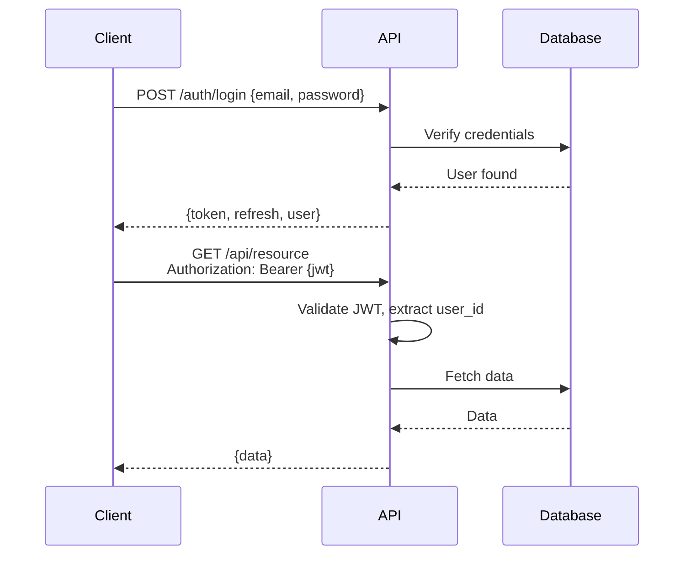
```mermaid
sequenceDiagram
    participant C as Client
    participant API as API
    participant DB as Database

    C->>API: POST /auth/login {email, password}
    API->>DB: Verify credentials
    DB-->>API: User found
    API-->>C: {token, refresh, user}

    C->>API: GET /api/resource<br/>Authorization: Bearer {jwt}
    API->>API: Validate JWT, extract user_id
    API->>DB: Fetch data
    DB-->>API: Data
    API-->>C: {data}
```

### OTP / Magic Link Flow

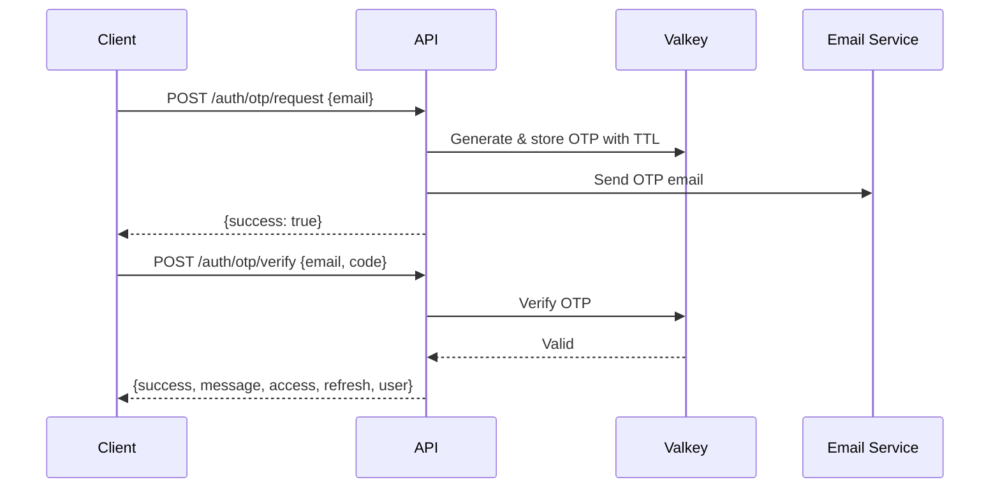
```mermaid
sequenceDiagram
    participant C as Client
    participant API as API
    participant R as Valkey
    participant E as Email Service

    C->>API: POST /auth/otp/request {email}
    API->>R: Generate & store OTP with TTL
    API->>E: Send OTP email
    API-->>C: {success: true}

    C->>API: POST /auth/otp/verify {email, code}
    API->>R: Verify OTP
    R-->>API: Valid
    API-->>C: {success, message, access, refresh, user}
```

---

## Background Tasks

### Celery Architecture

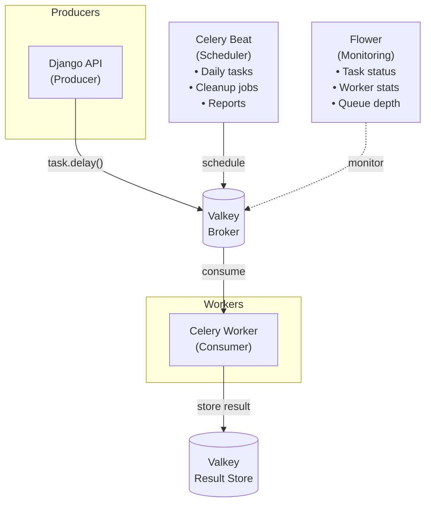
```mermaid
graph TB
    subgraph Producers
        DJANGO["Django API<br/>(Producer)"]
    end

    BROKER[("Valkey<br/>Broker")]
    RESULTS[("Valkey<br/>Result Store")]

    subgraph Workers
        WORKER["Celery Worker<br/>(Consumer)"]
    end

    BEAT["Celery Beat<br/>(Scheduler)<br/>• Daily tasks<br/>• Cleanup jobs<br/>• Reports"]

    FLOWER["Flower<br/>(Monitoring)<br/>• Task status<br/>• Worker stats<br/>• Queue depth"]

    DJANGO -->|"task.delay()"| BROKER
    BROKER -->|"consume"| WORKER
    WORKER -->|"store result"| RESULTS
    BEAT -->|"schedule"| BROKER
    FLOWER -.->|"monitor"| BROKER
```

---

## Deployment Options

### Decision Tree

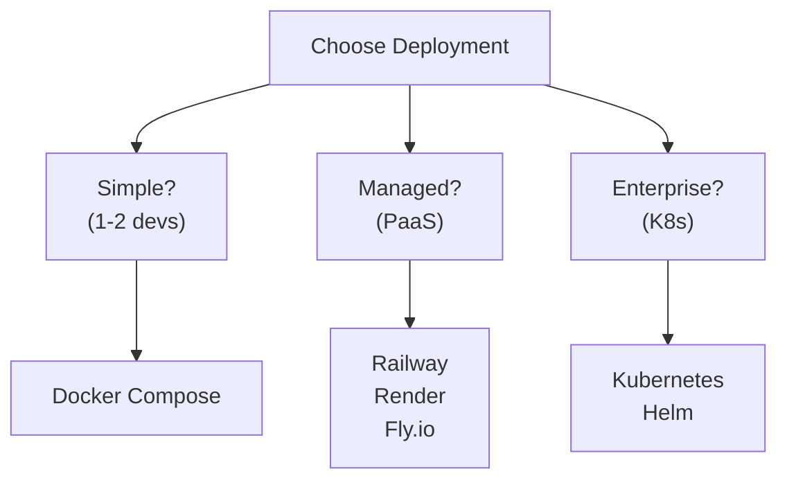
```mermaid
graph TB
    START["Choose Deployment"]

    SIMPLE["Simple?<br/>(1-2 devs)"]
    MANAGED["Managed?<br/>(PaaS)"]
    ENTERPRISE["Enterprise?<br/>(K8s)"]

    DOCKER["Docker Compose"]
    PAAS["Railway<br/>Render<br/>Fly.io"]
    K8S["Kubernetes<br/>Helm"]

    START --> SIMPLE & MANAGED & ENTERPRISE
    SIMPLE --> DOCKER
    MANAGED --> PAAS
    ENTERPRISE --> K8S
```

### Deployment Comparison

| Feature | Docker Compose | PaaS | Kubernetes |
|---------|---------------|------|------------|
| **Complexity** | Low | Low | High |
| **Scaling** | Manual | Auto | Auto |
| **Cost** | Fixed server | Pay-per-use | Variable |
| **Control** | Full | Limited | Full |
| **Setup Time** | Minutes | Minutes | Hours |
| **Best For** | Dev/Small prod | Startups | Enterprise |

### Kubernetes Architecture

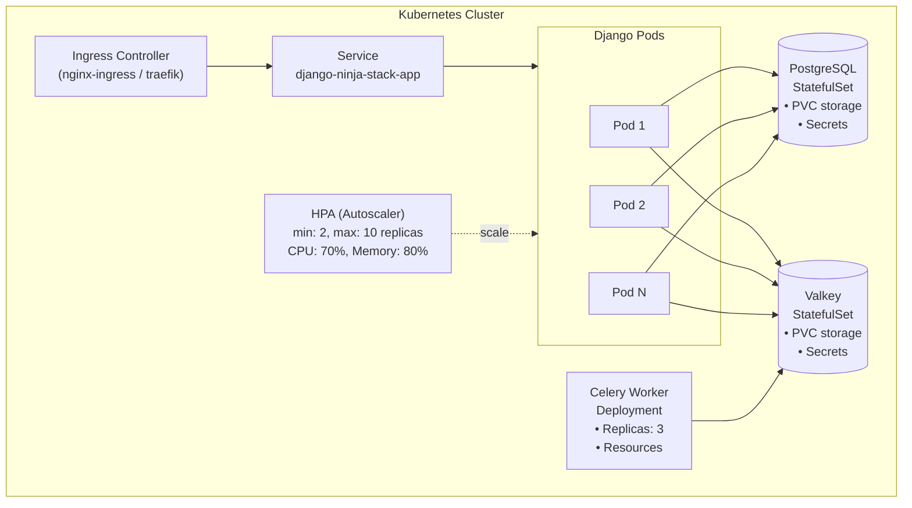
```mermaid
graph TB
    subgraph K8S["Kubernetes Cluster"]
        INGRESS["Ingress Controller<br/>(nginx-ingress / traefik)"]

        SVC["Service<br/>django-ninja-stack-app"]

        subgraph Pods["Django Pods"]
            P1["Pod 1"]
            P2["Pod 2"]
            PN["Pod N"]
        end

        HPA["HPA (Autoscaler)<br/>min: 2, max: 10 replicas<br/>CPU: 70%, Memory: 80%"]

        PG[("PostgreSQL<br/>StatefulSet<br/>• PVC storage<br/>• Secrets")]
        REDIS[("Valkey<br/>StatefulSet<br/>• PVC storage<br/>• Secrets")]
        CELERY["Celery Worker<br/>Deployment<br/>• Replicas: 3<br/>• Resources"]
    end

    INGRESS --> SVC --> Pods
    HPA -.->|"scale"| Pods
    P1 & P2 & PN --> PG & REDIS
    CELERY --> REDIS
```

---

## Performance Considerations

### ASGI server

Production runs `gunicorn api.asgi:application` with
`uvicorn_worker.UvicornWorker`. `gunicorn.conf.py` holds every setting, so
the Dockerfile, Compose, `Dockerfile.single`, Railway and k3s all run the same
command. Tune it with environment variables:

| Variable | Default | Effect |
|----------|---------|--------|
| `GUNICORN_WORKERS` | `3` | Worker processes. Start at one or two per CPU core. |
| `GUNICORN_TIMEOUT` | `120` | Seconds before Gunicorn restarts a stuck worker. |
| `PORT` | `8000` | Bind port. The image health checks probe the same port. |

Gunicorn plus uvicorn workers was chosen over Granian because it keeps the
process manager this project already ran (graceful reload, `max_requests`
recycling, the same logging) and changes only the worker class. Granian would
replace both and add a Rust server with its own flags and logging.

Sync Ninja views still work: Django wraps each request in a
`ThreadSensitiveContext`, so its sync code runs in a thread of its own. With
Valkey up, 2 workers answered 360 concurrent readiness requests and held 8
database connections (`DB_POOL_MAX_SIZE=4`). With Valkey down, readiness calls
finished about 9.4 s apart, so something on the cache-check path (the cache
client or the executor) serialized them; that is not yet traced.

Streaming responses must use async iterators under ASGI. Django drains a sync
iterator with `list()` before it sends a byte, which is why
`core/sse/views.py` picks `sse_stream_async` under ASGI.

### Database connection pool

Django 5.2 pools connections with psycopg 3 (`OPTIONS["pool"]`). psycopg2
ignores that option. The settings in `api/settings/common.py`:

| Variable | Default | Effect |
|----------|---------|--------|
| `DB_POOL_ENABLED` | `true` | Turn the pool off for forked task workers. |
| `DB_POOL_MIN_SIZE` | `2` | Connections each process keeps open. |
| `DB_POOL_MAX_SIZE` | `10` | Hard cap per process. |
| `DB_POOL_TIMEOUT` | `10` | Seconds a request waits for a free connection, then fails. |

`CONN_MAX_AGE` is `0`: Django raises `ImproperlyConfigured` when a pool is
combined with persistent connections. `CONN_HEALTH_CHECKS = True` stays valid:
with a pool it makes the pool check each connection before it hands it out.

Each process owns one pool. Size it against Postgres `max_connections`
(default 100):

```
web peak    = GUNICORN_WORKERS x DB_POOL_MAX_SIZE        (x replicas)
worker peak = task worker processes x 1                  (pool disabled)
total       = web peak + worker peak + migrations/admin  < max_connections

Defaults in the prod Compose stack:
  4 Gunicorn workers x 10 = 40
  Celery concurrency 4 + beat 1 = 5
  total about 45 of 100
```

Do not set `preload_app` in `gunicorn.conf.py`. The pool must be created
after the fork, in each worker.

Task workers fork after Django loads, so an inherited open pool would share
sockets between processes. Every task worker service in `docker-compose.yml`
sets `DB_POOL_ENABLED=false`. Celery, Huey, django-rq and Dramatiq workers ran
the database cleanup tasks with that setting; Celery prefork also ran them
with the pool on.

| Backend | Process model | With a pool |
|---------|---------------|-------------|
| Celery prefork | Forks children | Safe on Celery 5.6.1+: the Django fixup closes the pool in each child and after every task, so it opens `min_size` connections per task for nothing. |
| django-q2 | Sentinel forks and re-forks workers; it calls `connections.close_all()` first, which returns connections to the pool but leaves the pool open | Unsafe: children inherit the parent's open pool. |
| django-rq | Forks a work horse per job | Wasteful: each job opens a new pool. |
| Dramatiq | Worker processes, each with threads (`--processes 1 --threads 4`) | Not tested with the pool; kept off. |
| Huey | Threads in one process | Safe, but kept off for one rule across workers. |

pgvector needs no registration for the ORM. `pgvector.django.VectorField`
converts values itself: an insert and an `L2Distance` query work on psycopg 3
with the pool on. Call `pgvector.psycopg.register_vector` only for raw psycopg
connections.

The opt-in AI layer (`ai` extra, `core/ai/`) uses this path: see
[AI_LAYER.md](./AI_LAYER.md).
