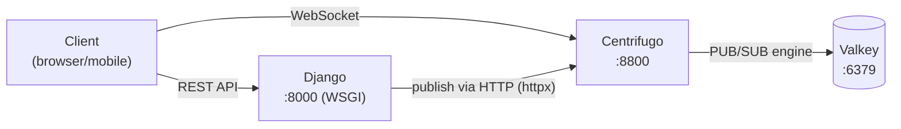

# Real-Time Messaging with Centrifugo

This project uses [Centrifugo](https://centrifugal.dev/) for real-time WebSocket communication. Centrifugo is a standalone server that handles all WebSocket connections, keeping Django as a pure WSGI application.

## Architecture



**Why Centrifugo instead of Django Channels:**

- Django stays WSGI — no Daphne, no ASGI, no async consumer code
- Centrifugo handles thousands of concurrent WebSocket connections efficiently
- No additional Python dependencies needed (`PyJWT` and `httpx` are already included)
- Clean separation: Django publishes events, Centrifugo delivers them

## Quick Start

### 1. Start Centrifugo

```bash
# Start all default services + Centrifugo
make up-realtime

# Or start everything (Celery + monitoring + realtime)
make up-full
```

Centrifugo will be available at `http://localhost:8800`. The admin UI is at `http://localhost:8800/` (password: `admin`).

### 2. Configure Environment Variables

The defaults work for local development. For production, set these in your `.env`:

```bash
CENTRIFUGO_URL=http://centrifugo:8000          # Internal Docker URL
CENTRIFUGO_API_KEY=your-secure-api-key         # Server-to-server auth
CENTRIFUGO_TOKEN_SECRET=your-secure-secret     # JWT signing secret
CENTRIFUGO_TOKEN_TTL=3600                      # Token lifetime in seconds
```

> **Important:** `CENTRIFUGO_TOKEN_SECRET` and `CENTRIFUGO_API_KEY` must match between Django settings and `deploy/centrifugo/config.json`. In Docker, they're passed as environment variables automatically.

### 3. Get a Connection Token

Clients need a JWT token to connect to Centrifugo. Call the token endpoint from your frontend:

```javascript
// 1. Get connection token from Django
const response = await fetch('/api/realtime/connection-token', {
  method: 'POST',
  headers: {
    'Authorization': `Bearer ${accessToken}`,
    'Content-Type': 'application/json',
  },
});
const { token } = await response.json();

// 2. Connect to Centrifugo
import { Centrifuge } from 'centrifuge';

const centrifuge = new Centrifuge('ws://localhost:8800/connection/websocket', {
  token: token,
});

centrifuge.connect();
```

### 4. Subscribe to Channels

Channels use namespaces defined in `deploy/centrifugo/config.json`. All channels require subscription tokens (private by default).

```javascript
// Get subscription token from Django
const subResponse = await fetch('/api/realtime/subscription-token', {
  method: 'POST',
  headers: {
    'Authorization': `Bearer ${accessToken}`,
    'Content-Type': 'application/json',
  },
  body: JSON.stringify({ channel: 'chat:conversation-uuid' }),
});
const { token: subToken } = await subResponse.json();

// Subscribe to the channel
const sub = centrifuge.newSubscription('chat:conversation-uuid', {
  token: subToken,
});

sub.on('publication', (ctx) => {
  console.log('New message:', ctx.data);
});

sub.subscribe();
```

### 5. Publish from Django

Use the `CentrifugoClient` to publish events from your Django code:

```python
from api.centrifugo import centrifugo_client

# Publish a chat message
centrifugo_client.publish("chat:conversation-uuid", {
    "type": "chat_message",
    "message": {
        "id": "msg-123",
        "content": "Hello!",
        "sender_id": "user-456",
        "created_at": "2026-02-24T12:00:00Z",
    },
})

# Broadcast to multiple users
centrifugo_client.broadcast(
    ["notifications:user-1", "notifications:user-2"],
    {"type": "notification", "data": {"title": "New update"}},
)
```

## API Endpoints

| Method | Path | Description |
|--------|------|-------------|
| `POST` | `/api/realtime/connection-token` | Get a Centrifugo connection JWT (requires auth) |
| `POST` | `/api/realtime/subscription-token` | Get a channel subscription JWT (requires auth) |

### Connection Token Response

```json
{
  "token": "eyJhbGciOiJIUzI1NiIs..."
}
```

### Subscription Token Request/Response

```json
// Request
{ "channel": "chat:conversation-uuid" }

// Response
{ "token": "eyJhbGciOiJIUzI1NiIs..." }
```

## Channel Namespaces

Configured in `deploy/centrifugo/config.json`:

| Namespace | Channel Pattern | Presence | History | Use Case |
|-----------|----------------|----------|---------|----------|
| `chat` | `chat:<conversation_id>` | Yes | 100 msgs / 5 min | Real-time messaging |
| `notifications` | `notifications:<user_id>` | No | 50 msgs / 24 hrs | User notifications |
| `organization` | `organization:<org_id>` | Yes | 50 msgs / 10 min | Org-wide announcements |

All namespaces have `allow_subscribe_for_client: false` — clients must obtain subscription tokens from Django.

## Django Integration

### Core Module: `api/centrifugo.py`

**Token generation:**

```python
from api.centrifugo import generate_connection_token, generate_subscription_token

# Connection token (for WebSocket handshake)
token = generate_connection_token(
    user_id="user-uuid",
    info={"username": "matt", "email": "matt@example.com"},
)

# Subscription token (for private channels)
token = generate_subscription_token(
    user_id="user-uuid",
    channel="chat:conv-123",
)
```

**Publishing events:**

```python
from api.centrifugo import centrifugo_client

# Single channel
centrifugo_client.publish("chat:conv-123", {"type": "message", "text": "hi"})

# Multiple channels
centrifugo_client.broadcast(["notifications:u1", "notifications:u2"], data)

# Presence (who's online)
result = centrifugo_client.presence("chat:conv-123")

# History (recent messages)
result = centrifugo_client.history("chat:conv-123", limit=20)

# Server-side subscription management
centrifugo_client.subscribe("user-id", "chat:conv-123")
centrifugo_client.unsubscribe("user-id", "chat:conv-123")
centrifugo_client.disconnect("user-id")
```

### Generated App Services

When using the code generators with `--realtime`, the generated apps include Centrifugo service classes:

```bash
# Generate a chat app with real-time support
python manage.py generate_feature chat --realtime
```

This creates a `ChatRealtimeService` in `<app>/services/realtime_service.py`:

```python
from chat.services.realtime_service import ChatRealtimeService

# Publish a message to a conversation
ChatRealtimeService.publish_message("conv-123", message_data)

# Publish typing indicator
ChatRealtimeService.publish_typing("conv-123", "user-id", "matt", is_typing=True)

# Get online users
presence = ChatRealtimeService.get_presence("conv-123")
```

## Production Deployment

### Docker Compose

Centrifugo runs under the `realtime` profile in both `docker-compose.yml` and `docker-compose.prod.yml`:

```bash
# Development
docker compose --profile realtime up -d

# Production
docker compose -f docker-compose.prod.yml --profile realtime up -d
```

### Nginx Proxy

The production nginx config proxies WebSocket connections at `/centrifugo/`:

```
Client --[wss://yourdomain.com/centrifugo/]--> Nginx --> Centrifugo:8000
```

When connecting from a browser in production:

```javascript
const centrifuge = new Centrifuge('wss://yourdomain.com/centrifugo/connection/websocket', {
  token: token,
});
```

### Environment Variables (Production)

```bash
# Generate strong secrets
CENTRIFUGO_API_KEY=$(openssl rand -hex 32)
CENTRIFUGO_TOKEN_SECRET=$(openssl rand -hex 32)
```

Set these in your production `.env` and ensure `deploy/centrifugo/config.json` uses `${CENTRIFUGO_TOKEN_SECRET}` and `${CENTRIFUGO_API_KEY}` (Centrifugo expands env vars in its config).

### Centrifugo Config: `deploy/centrifugo/config.json`

Key production settings to change:

```json
{
  "admin": false,
  "allowed_origins": ["https://yourdomain.com"]
}
```

### Health Check

```bash
curl http://localhost:8800/health
```

## Client Libraries

Centrifugo provides official client libraries:

| Platform | Package |
|----------|---------|
| JavaScript/TypeScript | `centrifuge` ([npm](https://www.npmjs.com/package/centrifuge)) |
| Swift (iOS/macOS) | `swift-centrifuge` ([SPM](https://github.com/centrifugal/centrifuge-swift)) |
| Dart/Flutter | `centrifuge-dart` ([pub.dev](https://pub.dev/packages/centrifuge)) |
| Go | `centrifuge-go` |
| Python | `cent` (server-side only) |

## Testing

Run the Centrifugo unit tests:

```bash
uv run pytest core/tests/test_centrifugo.py -v
```

Tests cover:
- Connection token generation (claims, expiration, custom TTL, info dict)
- Subscription token generation (channel claim, info dict)
- CentrifugoClient HTTP methods (publish, broadcast, subscribe, unsubscribe, disconnect, presence, history)
- Error handling (httpx exceptions)
